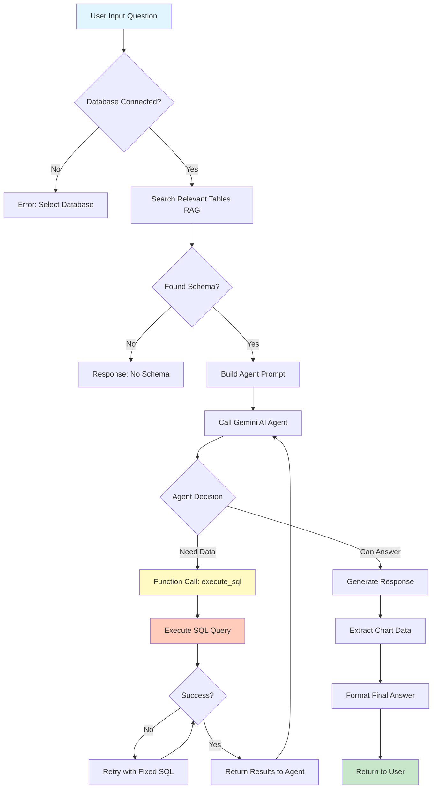

# DataLens AI - Kiến Trúc Hệ Thống

## Tổng Quan

DataLens AI là một hệ thống AI-powered database query assistant, cho phép người dùng tương tác với cơ sở dữ liệu bằng ngôn ngữ tự nhiên. Hệ thống sử dụng Google Gemini AI với Function Calling để tự động sinh và thực thi SQL queries.

## Kiến Trúc Tổng Thể

```
┌─────────────────────────────────────────────────────────────┐
│                        USER INTERFACE                        │
│  (React + TypeScript + Redux)                               │
└─────────────────────┬───────────────────────────────────────┘
                      │
                      ▼
┌─────────────────────────────────────────────────────────────┐
│                    FRONTEND SERVICES                         │
│  - AI Service Factory                                        │
│  - Database API Service                                      │
│  - Schema Search Service                                     │
│  - Query Execution Service                                   │
└─────────────────────┬───────────────────────────────────────┘
                      │
                      ▼
┌─────────────────────────────────────────────────────────────┐
│                    BACKEND SERVER                            │
│  (Express + TypeScript)                                      │
│  - Database Info Repository                                  │
│  - Schema Info Repository                                    │
│  - Schema Service                                            │
│  - Query Execution Service                                   │
│  - Embedding Service (PostgreSQL + pgvector)                │
└─────────────────────┬───────────────────────────────────────┘
                      │
                      ▼
┌─────────────────────────────────────────────────────────────┐
│                  EXTERNAL SERVICES                           │
│  - Google Gemini AI (Smart Agent + Function Calling)        │
│  - Target Databases (MSSQL, PostgreSQL, MySQL)              │
│  - Vector Database (PostgreSQL + pgvector)                   │
└─────────────────────────────────────────────────────────────┘
```

## Thành Phần Chính

### 1. **Smart AI Agent** (Core Feature)
📁 `src/services/aiService2.ts`

Đây là trái tim của hệ thống - một intelligent agent sử dụng Google Gemini với Function Calling.

**Kiến trúc Agent:**
```typescript
┌──────────────────────────────────────────────┐
│         Smart AI Agent (Gemini 2.5)         │
│                                              │
│  ┌────────────────────────────────────┐    │
│  │   System Instruction               │    │
│  │   - Database Schema Context        │    │
│  │   - SQL Guidelines                 │    │
│  │   - Chart Generation Rules         │    │
│  └────────────────────────────────────┘    │
│                                              │
│  ┌────────────────────────────────────┐    │
│  │   Function Declarations            │    │
│  │   - execute_sql()                  │    │
│  │     • sql: string                  │    │
│  │     • purpose: string              │    │
│  └────────────────────────────────────┘    │
│                                              │
│  ┌────────────────────────────────────┐    │
│  │   Iterative Execution Loop         │    │
│  │   1. Parse user question           │    │
│  │   2. Decide: Query or Respond?     │    │
│  │   3. Call execute_sql if needed    │    │
│  │   4. Analyze results               │    │
│  │   5. Generate final answer         │    │
│  │   6. Extract chart data            │    │
│  └────────────────────────────────────┘    │
└──────────────────────────────────────────────┘
```

**Cải tiến so với Multi-step Approach:**
- ✅ **Đơn giản hơn**: Một agent thay vì nhiều bước phức tạp
- ✅ **Thông minh hơn**: AI tự quyết định khi nào cần query database
- ✅ **Nhanh hơn**: Không có bước query không cần thiết
- ✅ **Tự nhiên hơn**: Luồng hội thoại mượt mà
- ✅ **Linh hoạt**: Xử lý cả data queries và general chat

### 2. **Schema Management & RAG System**

#### 2.1 Schema Extraction & Cleaning
```typescript
Database → Raw Schema → AI Cleaning → Enriched Schema → Vector Storage
```

**Flow chi tiết:**
1. **Extract Schema**: Query metadata từ database (tables, columns, relationships)
2. **AI Cleaning**: Gemini AI làm sạch và làm giàu schema
   - Loại bỏ system tables không cần thiết
   - Thêm business descriptions
   - Phân loại theo categories
   - Đánh dấu relevance
3. **Batch Processing**: Xử lý 50 tables/batch cho schema lớn
4. **Vector Storage**: Lưu embeddings vào PostgreSQL + pgvector

#### 2.2 Schema Search (RAG)
```typescript
User Question → Embedding → Vector Search → Top 15 Relevant Tables → AI Agent
```

**Ưu điểm:**
- Chỉ gửi relevant schema cho AI (tiết kiệm tokens)
- Semantic search cho kết quả chính xác
- Scale tốt với database lớn (hàng trăm tables)

### 3. **Query Flow - End-to-End**



### 4. **Conversation Context Management**

```typescript
interface ConversationContext {
  question: string;
  answer: string;
  sql?: string;
  timestamp: number;
}
```

**Features:**
- Lưu trữ lịch sử hội thoại
- Context-aware responses
- Multi-turn conversations
- Follow-up questions

### 5. **Chart Data Generation**

AI Agent tự động phát hiện và generate chart data phù hợp:

```typescript
interface ChartData {
  type: "bar" | "pie" | "line" | "none";
  data: Array<{ name: string; value: number }>;
  xAxisKey?: string;
  yAxisKey?: string;
  description?: string;
}
```

**Chart Type Rules:**
- **Bar**: So sánh categories (2-20 items) - Sales by region, orders by status
- **Pie**: Tỷ lệ phần trăm (3-8 slices) - Market share, status distribution  
- **Line**: Xu hướng theo thời gian (5+ points) - Monthly sales, user growth
- **None**: Dữ liệu không phù hợp cho visualization

## Database Support

### Supported Databases
- ✅ **Microsoft SQL Server** (MSSQL)
- ✅ **PostgreSQL**
- ✅ **MySQL**

### Schema Extraction Queries
📁 `server/db/get-schema/`
- `mssql.sql` - INFORMATION_SCHEMA queries for SQL Server
- `postgres.sql` - PostgreSQL system catalog queries
- `mysql.sql` - MySQL INFORMATION_SCHEMA queries

## Technology Stack

### Frontend
- **React 18** - UI framework
- **TypeScript** - Type safety
- **Redux Toolkit** - State management
- **Vite** - Build tool
- **Recharts** - Data visualization

### Backend
- **Node.js + Express** - API server
- **TypeScript** - Type safety
- **PostgreSQL + pgvector** - Vector database for embeddings
- **Google Gemini AI** - LLM for query generation

### VS Code Extension
📁 `vs-extension/`
- Tích hợp DataLens AI trực tiếp vào VS Code
- Chat panel với database connection
- Quick access từ editor

## Security & Best Practices

### SQL Injection Prevention
- ✅ Agent chỉ generate SELECT statements
- ✅ Không cho phép INSERT, UPDATE, DELETE, DROP
- ✅ Schema prefix bắt buộc
- ✅ LIMIT/TOP clause mặc định

### Error Handling
- **Retry Logic**: Tự động retry với fixed SQL (max 2 attempts)
- **Fallback Answers**: Trả về kết quả hợp lý khi agent fails
- **Common SQL Fixes**: Auto-fix missing schema prefix, syntax errors

### Performance Optimization
- **Batch Processing**: Xử lý schema theo batch (50 tables)
- **Lazy Loading**: Chỉ load relevant tables
- **Query Limits**: Giới hạn kết quả (10-100 rows)
- **Vector Search**: Fast semantic search với pgvector
- **Iterative Execution**: Max 5 iterations để tránh infinite loops

## Data Flow Example

### Ví dụ: "Show me top 5 products by sales"

```
1. User Input
   ↓
2. RAG Search → Find tables: [Products, Sales, OrderItems]
   ↓
3. AI Agent receives:
   - Question: "Show me top 5 products by sales"
   - Schema: Products, Sales, OrderItems definitions
   - Conversation history (if any)
   ↓
4. Agent Decision → "Need to query database"
   ↓
5. Function Call: execute_sql
   sql: "SELECT TOP 5 p.ProductName, SUM(oi.Quantity * oi.Price) as TotalSales 
         FROM dbo.Products p 
         JOIN dbo.OrderItems oi ON p.ProductID = oi.ProductID 
         GROUP BY p.ProductName 
         ORDER BY TotalSales DESC"
   ↓
6. Execute SQL → Returns results
   ↓
7. Agent analyzes results → Generate insights
   ↓
8. Extract chart data → type: "bar"
   ↓
9. Format markdown answer with table + insights
   ↓
10. Return to user with chart visualization
```

## Future Improvements

### Planned Features
- [ ] Support for more databases (Oracle, MongoDB)
- [ ] Multi-database queries (JOIN across databases)
- [ ] Query optimization suggestions
- [ ] Natural language to SQL training mode
- [ ] Export results to CSV/Excel
- [ ] Scheduled queries & alerts
- [ ] Dashboard builder with saved queries

### AI Enhancements
- [ ] Fine-tuning for domain-specific queries
- [ ] Custom schema annotations
- [ ] Query performance prediction
- [ ] Automatic index suggestions
- [ ] Data quality insights

## Development Setup

### Prerequisites
```bash
Node.js >= 18
PostgreSQL >= 14 (with pgvector extension)
pnpm >= 8
```

### Installation
```bash
# Clone repository
git clone <repo-url>

# Install dependencies
pnpm install

# Setup environment
cp .env.example .env
# Add VITE_GEMINI_API_KEY

# Start PostgreSQL with pgvector
docker-compose up -d

# Run migrations
cd server && pnpm run migrate

# Start dev server
pnpm dev
```

### Project Structure
```
datalens-ai/
├── src/                      # Frontend React app
│   ├── components/          # UI components
│   ├── services/            # API & AI services
│   │   └── aiService2.ts   # 🌟 Smart AI Agent (Core)
│   ├── store/              # Redux state management
│   └── pages/              # Application pages
├── server/                  # Backend API server
│   ├── src/
│   │   ├── services/       # Business logic
│   │   ├── repositories/   # Data access layer
│   │   └── db/            # Database utilities
│   └── db/
│       ├── migrations/     # SQL migrations
│       └── get-schema/     # Schema extraction queries
├── vs-extension/           # VS Code extension
└── docker-compose.yml      # PostgreSQL + pgvector setup
```

## API Endpoints

### Database Management
- `POST /api/databases` - Add new database connection
- `GET /api/databases` - List all databases
- `GET /api/databases/:id/schema` - Get database schema
- `POST /api/databases/:id/index-schema` - Generate embeddings

### Query Execution
- `POST /api/query/execute` - Execute SQL query
- `POST /api/query/ai` - AI-powered natural language query

### Schema Search
- `POST /api/schema/search` - Semantic search for relevant tables

## Contributing

### Code Style
- TypeScript strict mode
- ESLint + Prettier
- Conventional commits

### Testing
```bash
# Run tests
pnpm test

# Run with coverage
pnpm test:coverage
```

## License

MIT License - See LICENSE file for details

---

**Built with ❤️ using Google Gemini AI & PostgreSQL**
